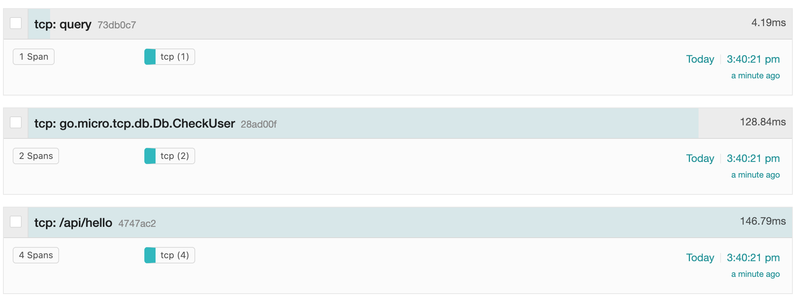

# TiEM - TiDB Enterprise Manager

## Contents

- library - Common components and resources.
- micro-api - OpenAPI http handler.
- micro-cluster - Core service.
- micro-metadb - Client of go-micro service.
- docs - Documentation.

## Build and Run TiEM

TiEM can be compiled and used on Linux, OSX, CentOS, It is as simple as:
```
make
```

After building TiEM, it is good idea to test it using:
```
make test
```

### Run Service
If you want to run the service locally, try the following commands, good luck!!

start metadb-server

```shell
$ ./bin/metadb-server --host=127.0.0.1 --registry-address=127.0.0.1:4101
```

start cluster-server
```shell
$ ./bin/cluster-server --host=127.0.0.1 --metrics-port=4122 --registry-address=127.0.0.1:4101
```

start openapi-server
```shell
$ ./bin/openapi-server --host=127.0.0.1 --metrics-port=4123 --registry-address=127.0.0.1:4101 --elasticsearch-address=127.0.0.1:9200
```

### Try it out
via swagger : http://localhost:4116/swagger/index.html
or : http://localhost:4116/system/check

### Watch Traces

Visit the web interface of Jaeger from port 16686.




### Collect Promethus Merics

The Promethus metrics is exported as http resource and is located at ":${PrometheusPort}/metrics" which the `PrometheusPort` is defined in the configure file.

## Code Style Guide

See [Effective Go](https://golang.org/doc/effective_go) for the style guide.

## How to Log

For example:

```go
import(
	"github.com/pingcap/tiem/addon/logger"
)
```

```go
func CheckUser(ctx context.Context, name, passwd string) error {
	log := logger.WithContext(ctx).WithField("models", "CheckUser").WithField("name", name)
	u, err := FindUserByName(ctx, name)
	if err == nil {
		getLogger().Info("user:", u)
		if nil == bcrypt.CompareHashAndPassword([]byte(u.FinalHash), []byte(u.Salt+passwd)) {
			getLogger().Debug("check success")
			return nil
		} else {
			return fmt.Errorf("failed")
		}
	} else {
		return err
	}
}
```

```go
func init() {
    var err error
    dbFile := "tiem.sqlite.db"
    log := logger.WithContext(nil).WithField("dbFile", dbFile)
    getLogger().Debug("init: sqlite.open")
    db, err = gorm.Open(sqlite.Open(dbFile), &gorm.Config{})
    /* ... */
}
```

Basically, use `logger.WithContext(ctx)` to get the `log` if there is a valid ctx to inherit, or otherwise, use `logger.WithContext(nil)` to get the default getLogger().

```go
func (d *Db) CheckUser(ctx context.Context, req *dbPb.CheckUserRequest, rsp *dbPb.CheckUserResponse) error {
	ctx = logger.NewContext(ctx, logger.Fields{"micro-service": "CheckUser"})
	log := logger.WithContext(ctx)
	e := models.CheckUser(ctx, req.Name, req.Passwd)
	if e == nil {
		getLogger().Debug("CheckUser success")
	} else {
		getLogger().Errorf("CheckUser failed: %s", e)
		rsp.ErrCode = 1
		rsp.ErrStr = e.Error()
	}
	return nil
}
```

Use something like `logger.NewContext(ctx, logger.Fields{"micro-service": "CheckUser"})` to create a new ctx from the old ctx with new customized log fields added.
